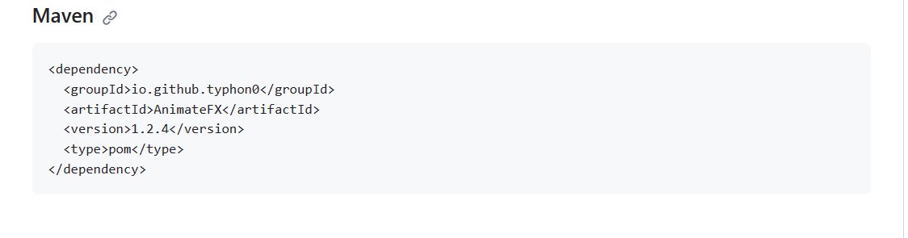
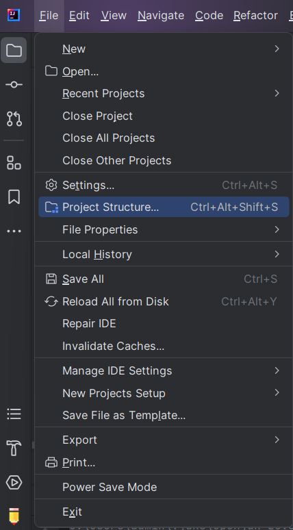
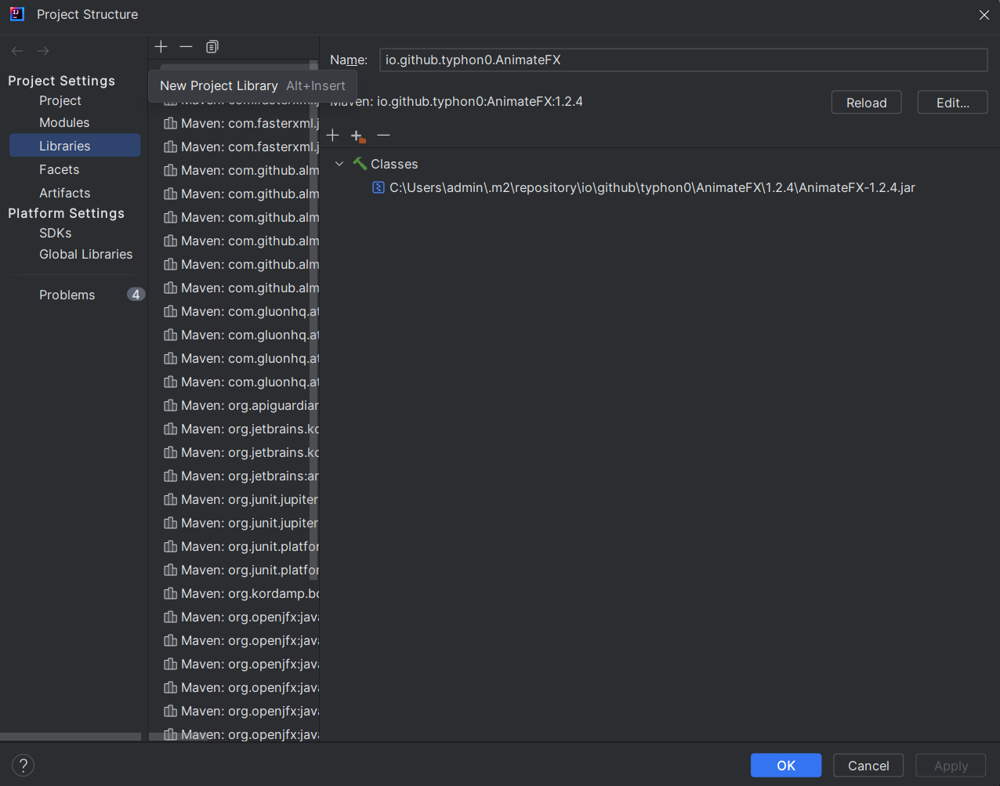
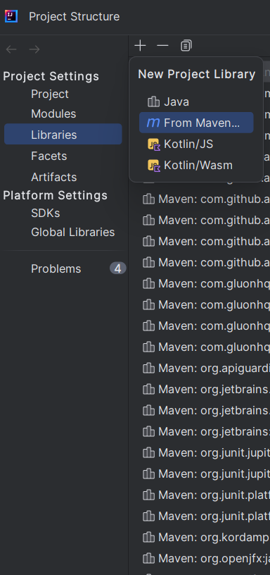
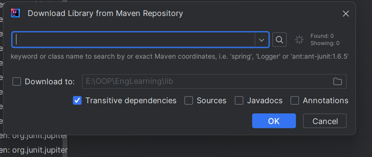
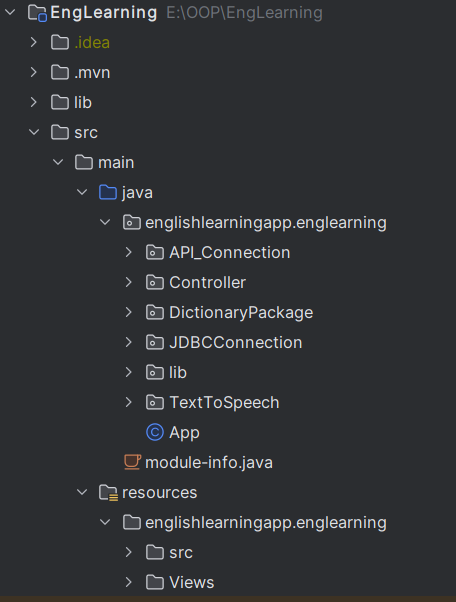
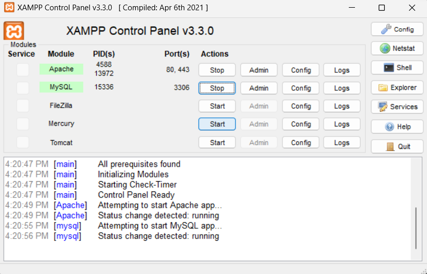
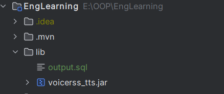
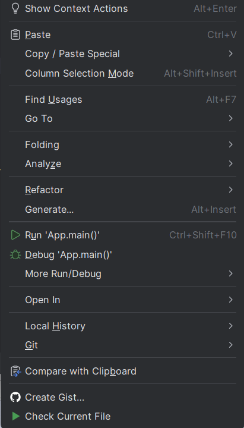

# EngLearn App

This project was created to assist learners who are studying
English and requiring a tool to enhance their effectiveness...
But the main purpose is to get scores in my OOP course...
### Features: 

- Looking up words in dictionary.
- Translate paragraphs.
- Word can be pronounced.
- Add new words, modify words or delete from dictionary.
- Games assist users learning English.
- Vivid GUI.

## Installation

#### - In order to run this application, you need these things below:

- An IDE that can run javafx application(eg: Intellij, Eclispe, ...). Because i use IntelliJ so i will this app to guide
. If you guys use the others, please do the same sequence.
- JDK 8 or one of the SDK versions which support javafx. 
- SQL server.
- A tool to open SQL server(eg: XAMPP, Workbench, ...).

#### - Now follow these steps below to install this app correctly:


##### Step 1: 
- Download this project.
##### Step 2:
- Go to this link: https://github.com/Typhon0/AnimateFX and you scroll down until see this:

- Copy all of this code.
- Go to this  
- And go to tab libraries and click the "+" button on the top-left corner then click "From Maven".


- And it will pop up a dialog like this

- Patse all what you did copy before in the text box and click OK.
##### Step 3:
- When you open the project you will see the project structure similar to this: 
- Add two folders name "lib" to your libraries by clicking right click in jar files inside those folders and click "Add as library".
- Do some additional steps to install animation library.
##### Step 4:
- Open your SQL server first with your tool, It will look like this in XAMPP
- Open the tool that manage your SQL server and go to tab "SQL" and insert these codes:
```bash
  CREATE DATABASE dictionary
  USE dictionary
  CREATE TABLE dicttable (
    word VARCHAR(255),
    pronunciation VARCHAR(255),
    definition MEDIUMTEXT
  );
```
- After that, Run this code by clicking button "Go" if you use phpMyAdmin.
- when these codes above did run, go to tab "Import" and import the "output.sql" .
- When all done,  go to App.java right click inside and click "Run App.main()".
- After clicking that, you successfully install and run this app. Good Luck!

## Tech Stack
**Server:** mySQl.

**Dev:** Javafx, Voicerrs, Maven, AnnimateFX;

## Author
[Lê Đức](https://www.github.com/Lee-412)

[Lê Hiển](https://www.github.com/LeHien2818)